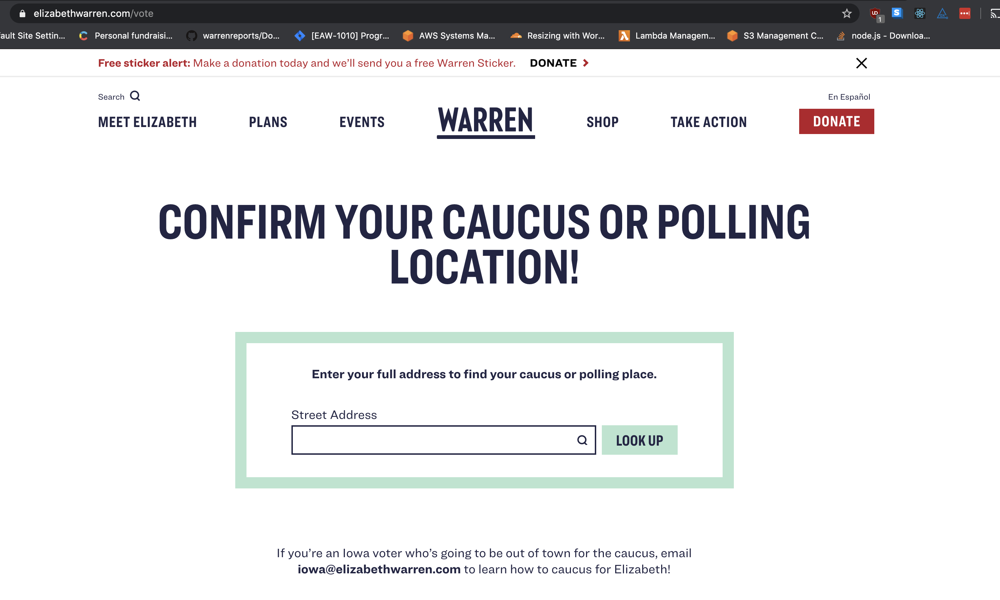
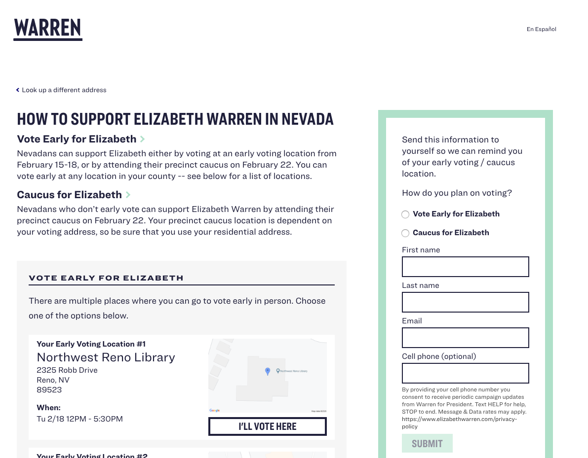
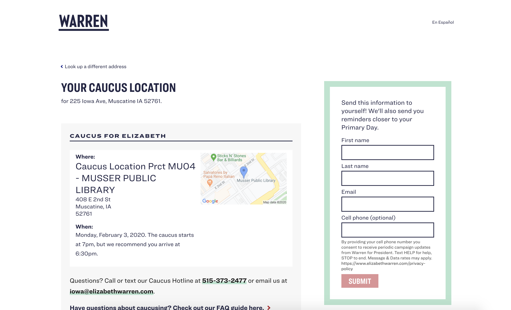

# Pollaris

Pollaris is an app to help people find their polling locations. Users can look up their address and see their options for where, when, and how they can vote, including regular polling locations, early vote locations, dropbox locations, and mail-in ballot information. They can additionally choose to get the information emailed or texted to them, as well as sign up for future reminders and updates.

The app is built with a Django and Postgres backend and Gatsby.js, React, and Contentful on the frontend.

See more details in the READMEs and code for [backend](backend) and [frontend](frontend).

Some screenshots of Pollaris in action:

Search box:

Results with multiple caucus/voting options:

Results with one option:
